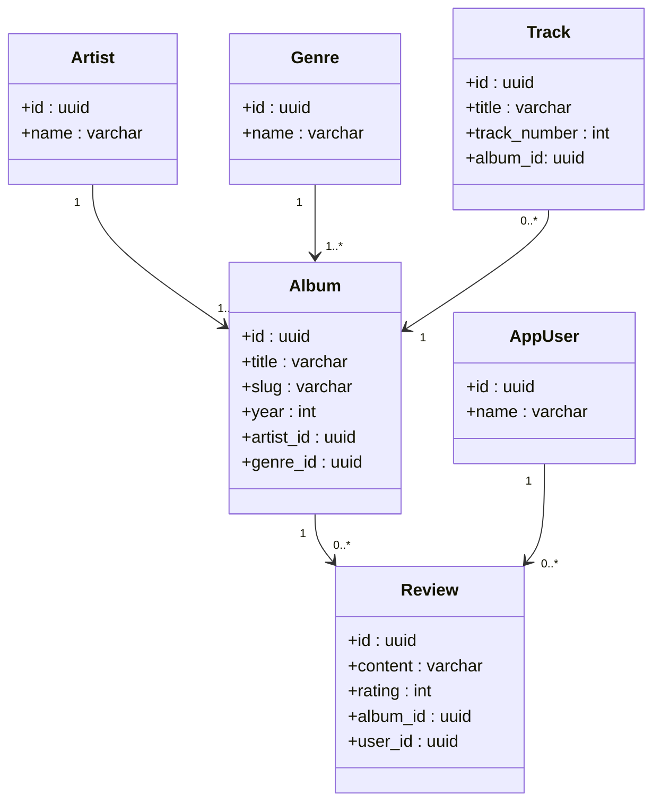
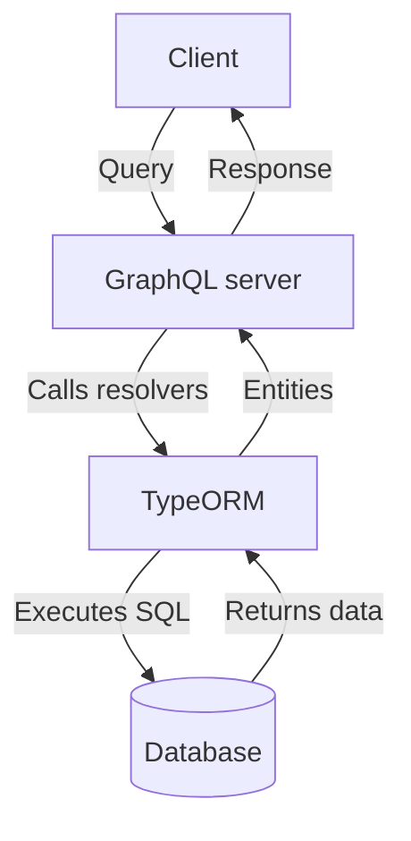

## Album collection GraphQL server

Building a GraphQL server using TypeGraphQL and TypeORM.

### Database class diagram

```mermaid
classDiagram

class Artist {
    +id : uuid
    +name : varchar
}

class Genre {
    +id : uuid
    +name : varchar
}

class Track {
    +id : uuid
    +title : varchar
    +track_number : int
    +album_id: uuid
}

class Album {
    +id : uuid
    +title : varchar
    +slug : varchar
    +year : int
    +artist_id : uuid
    +genre_id : uuid
}

class AppUser {
    +id : uuid
    +name : varchar
}

class Review {
    +id : uuid
    +content : varchar
    +rating : int
    +album_id : uuid
    +user_id : uuid
}

Artist "1" --> "1..*" Album
Genre "1" --> "1..*" Album
Track "0..*" --> "1" Album
Album "1" --> "0..*" Review
AppUser "1" --> "0..*" Review
```
### GraphQL server architecture

```mermaid
    flowchart TD
        Client[Client]
        GraphQL[GraphQL server]
        TypeORM[TypeORM]
        DB[(Database)]

        Client -->|Query| GraphQL
        GraphQL -->|Calls resolvers| TypeORM
        TypeORM -->|Executes SQL| DB
        DB -->|Returns data| TypeORM
        TypeORM -->|Entities| GraphQL
        GraphQL -->|Response| Client
```